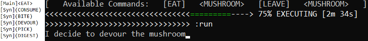
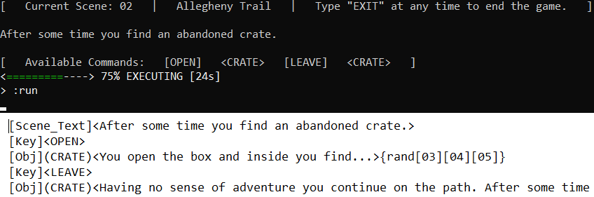

# Project Report
# Group members: Danny Ullrich, Maxwell Boshaw, Caden Koscinski, Zachary Canali

Our motivation for this project was to create a modular text based adventure game, both from personal interest, and because we saw it as an opportunity to harness our collective skills. Throughout the whole process, we slowly began to divide our effort based on our personal skills. For each of us, this project can serve as a starting point for any future endeavors. If one of us were to decide to make another, serious, text adventure, we would simply use this code and change the scene files, while could be added or reduced based on the needs of the story. Since we have spent so much time working on this project, it proves to be a testament of our skill and dedication to the project, which is in itself a source of entertainment for whoever uses it. Users could also use this to create their own adventures, since the program is modular, not hardcoded. There is a small chance that we will continue to work on this text adventure in one way or another in the future, either for our own personal enjoyment, or in a future assignment, should it be allowed. We are all very proud of our finished product.

This project was a team effort as each member of our four person team had an important role. Danny and Caden worked together to write the majority of the code, with Danny writing most of the input class, while Caden workied on optimization and implementing the dictionary as well as the parsing system. Caden also had the idea for our 3D array method, which was used as the basis for the code. Zach wrote the beginning of the story with Max’s help, and Max finished the last chapter of the story with edits from the team. Zach also provided Caden and Danny with the functionality he needed to write the story the way he wanted. Max spent a good amount of time working on the UML diagrams and helping extensively with planning how the code will work in the initial stages. The code was a big challenge but the creation of the UML diagrams was equally difficult due to the complexity of the code as well as the fact that the code was being changed constantly. The story was also a challenge in its own right because everything needed to intertwine and connect properly. We also wanted to create a genuine story and world, which added a necessity for creativity in the project.

The class interaction of this program is highly complex for programmers of our level. With our three main classes being Input, Main, and Scene, we sometimes had trouble keeping track of what methods were in which class. As our program continued to evolve, we ended up moving methods and objects, condensing entire classes into one another, and changing methods entirely to meet our required needs. The basic interaction of our classes, even at surface level, is not very simplistic. The user puts input into the system, the main class interprets it and communicates with Input and/or Scene, Input and Scene interact with each other to find the proper scene files, the scene file gives an output, this output is then sent back through Input, Scene, and Main, which in turn gives the user his or her desired output. Overall, our code could be simplified and possibly streamlined to look nicer and run more efficiently, but for the purposes of the project we are satisfied with the current outcome.

| Input | Main | Scene |
| --- | --- | --- |
| - dict : String                   | + userInput : String | - sceneId : String |
| - keyIndex : int                  | + inputOk : boolean  | - sceneText : String |
| - keyNum : int                    | - | - keyNum : int |
|  - startNum : int                 | - | - keyIndex : int |
|  - vars : String                  | - | - |
| ---                               | --- | --- |
| << constructor >> input()         | + clearScreen() | << constructor >> Scene() |
| + getInput() : String             | - | + checkObject(String commandIn, String ObjectIn) : boolean |
| + initDictionary()                | - | + printScene() |
| + parse(String input) : String    | - | + readScene(String inputSceneId) |
|  + readConfig()                   | - | - |
|  + getVar(String varInput) : int  | - | - |

Due to the modular nature of the program, there are no definitive results in the sense of an input-output relationship. In fact, the modular scenes which compose the adventure are intended to be written by another user, and thus function as both the input and the output in one file. Disregarding this notion, the overall interface, user interaction, and progression of scene files work rather well in unison. The interpretive parsing system does not require a dictionary file, but when one is present the user can likely input a range of pre-designated verbs that resemble the original intended input. While minimalistic, the logic system that also handles this input correctly associates and connects the necessary scenes. Furthermore, transitioning to a focus on the scenes themselves, the console and program correctly display the content of the modular files in a fashion suitable for the user to navigate. In regards to the more complex aspects of the output of the program, the user written story arc must be consulted. Provided that the correct template is adhered to, the program can interpret the direction of the story arc as needed. Random encounters, previous scenes, and basic progression can all be utilized as necessary.

The usage of dictionaries and different encounter logic.

The final result of the project is a close approximation of our original intent. In terms of infinite scalability, the modular nature of the program enables the user to design story arcs and adjust the flexibility of the parsing system with very little knowledge of computer science. Due to the interpretive parsing system, the user is presented with the minimum requirements in order to easily progress the story. Another benefit of the display of options is a simple and user-friendly interface that negates the disadvantages of the command console. In general, the interaction between the user and user-created story is relatively smooth. As far as challenges were concerned, the entire concept of modularity required abstract, computational thinking and a complete inability to hard code. Additionally, the process of learning how to interpret a modular file demanded the use of delimiters, 3D arrays, and various applications of the “null” value. Once the modularity was implemented, another challenge arose in the creation of a type of logic method which handled the interaction between the different modular files. The greatest benefit in overcoming these issues is the ability to foresee and compensate for a massive variety of user-based input without the program failing.
